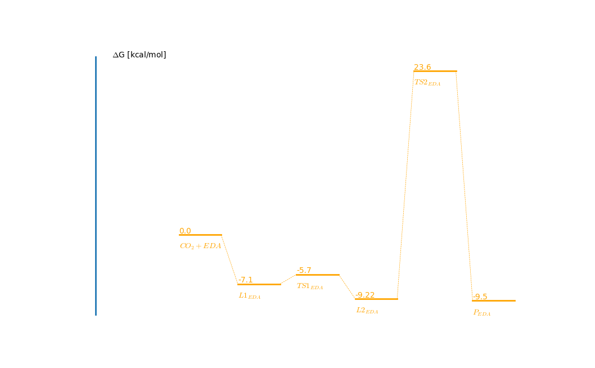
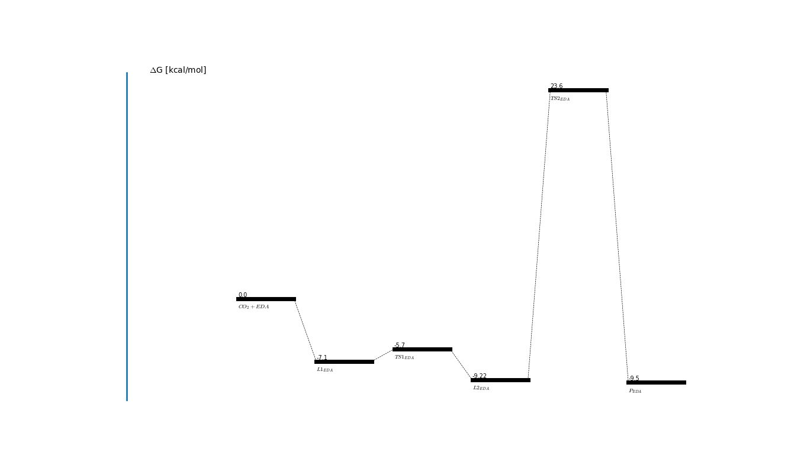
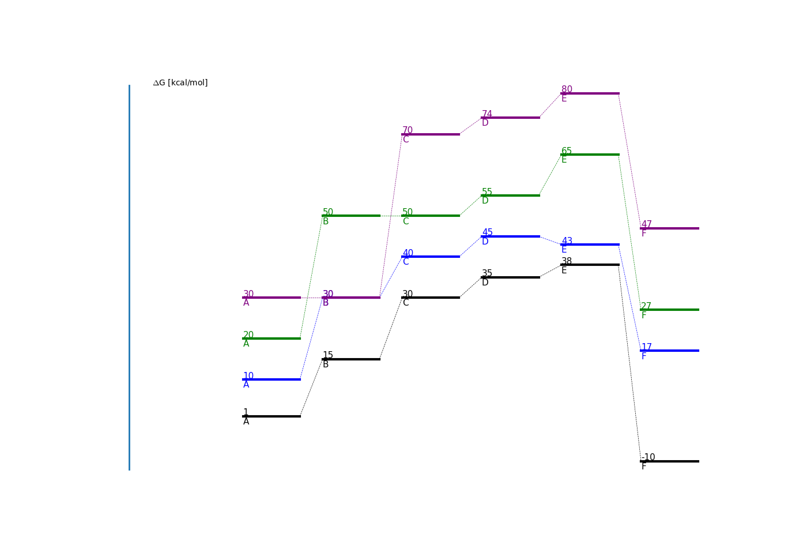

# PESPLOT
This script is meant to be use to create PES(Potential Energy Surface) plots with
variety of configurations and color options. The script is platform independent meaning
that yous should be able to use it on any machine.
## Requirements
Anyone who has Python 3 and matplotlib installed should be able to use the script.
After installing Python 3 use pip to install matplotlib.

    pip install matplotlib

## Input File
The script supports .json files at the moment. Support for excel files will be added in
future.

Example input files look like:

    {
      "colors": [
        "red",
        "green"
      ],
      "data": {
        "CO_(2)+EDA": [0.0, 2.0],
        "L1_(EDA)": [-7.1, -3.1],
        "TS1_(EDA)": [-5.7, -2.1],
        "L2_(EDA)": [-9.2, -3.2],
        "TS2_(EDA)": [23.6, 35.6],
        "P_(EDA)": [-9.5, -4.5]
      }
    }

**Note:** To create subscripted text use notation `prefix_(subscript)_suffix`. For
instance for L1EDA the notation would be L1_(EDA). This will make it appear
subscripted on the plot.

## Configurations
The following can be configured:
* Line width
* Line color
* Dashed line width
* Text size
* Plot style

Examples on how to configure will be given in the next section.

## Examples
Provide data file to the script. Provide absolute path to a data file. That way the script
will always work.

    python data/data_one_route.json

This will plot with default argument.

* Configure with line width and text size.

    python data/data_one_route.json --line-width 5 --text-size 7

* Plot multiple routes

   python pesplot.py data/data_four_routes.json --line_width 3 --text_size 11

## Limitations

